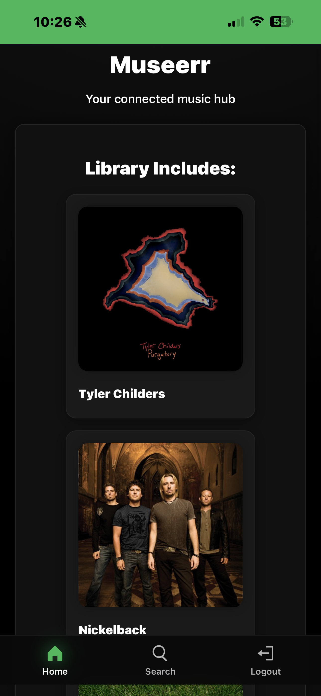
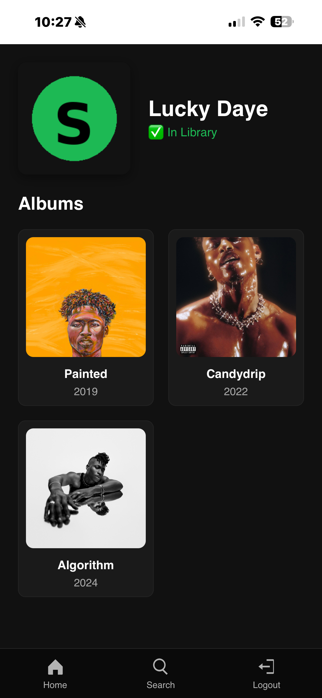

# 🎵 Museerr

**Museerr** is a self-hosted music discovery dashboard built for [Lidarr](https://lidarr.audio).  
It provides a clean web interface for browsing artists, albums, and managing your music library — powered by Lidarr’s API.

<p align="center">
  
  
</p>

## ✨ Features

- 🎶 Browse and search artists directly from your Lidarr library  
- 💿 View album details and track listings  
- 🧠 Automatically displays artist images and metadata  
- ⚙️ Simple configuration via environment variables  
- 🌐 Lightweight FastAPI backend with responsive HTML frontend  
- 💾 Runs fully locally — no external dependencies  

---

## 🚀 Quick Start (Docker)

### Using Docker CLI
```bash
docker run -d   --name=museerr   -p 5001:5001   -e LIDARR_URL=http://192.168.5.47:8686/api/v1   -e LIDARR_API_KEY=your_lidarr_api_key_here   -e LIDARR_ROOT_FOLDER=/music   -e LIDARR_PROFILE_NAME=Any   -v /path/on/host/config:/config   -v /path/on/host/music:/music   lpuffyy/museerr:latest
```

### Using Docker Compose
```yaml
version: "3.8"

services:
  museerr:
    image: lpuffyy/museerr:latest
    container_name: museerr
    restart: unless-stopped
    ports:
      - "5001:5001"
    environment:
      - LIDARR_URL=http://192.168.5.47:8686/api/v1
      - LIDARR_API_KEY=your_lidarr_api_key_here
      - LIDARR_ROOT_FOLDER=/music
      - LIDARR_PROFILE_NAME=Any
      - TZ=Etc/UTC
    volumes:
      - /path/on/host/config:/config
      - /path/on/host/music:/music
```

Then open your browser to:  
👉 **http://localhost:5001**

---

## ⚙️ Environment Variables

| Variable | Description | Example |
|-----------|-------------|----------|
| `LIDARR_URL` | URL to your Lidarr API endpoint (include `/api/v1`) | `http://192.168.5.47:8686/api/v1` |
| `LIDARR_API_KEY` | Your Lidarr API key | `1234567890abcdef` |
| `LIDARR_ROOT_FOLDER` | Path to your music folder | `/music` |
| `LIDARR_PROFILE_NAME` | Default Lidarr profile | `Any` |
| `TZ` | Container timezone | `Etc/UTC` |

---

## 🧩 Technical

- **Base Image:** `python:3.12-slim`  
- **Backend:** FastAPI + Uvicorn  
- **Frontend:** HTML / CSS / JavaScript  
- **Port:** `5001`  

---

## 🐳 Docker Hub

Image available on Docker Hub:  
👉 [lpuffyy/museerr](https://hub.docker.com/r/lpuffyy/museerr)

---

## ❤️ Credits

Museerr was inspired by the simplicity of Overseerr and the organization of Lidarr,  
created to give music collectors a fast and modern dashboard for their libraries.

---

## 📜 License

MIT License © 2025 [lpuffyy](https://github.com/lpuffyy)
